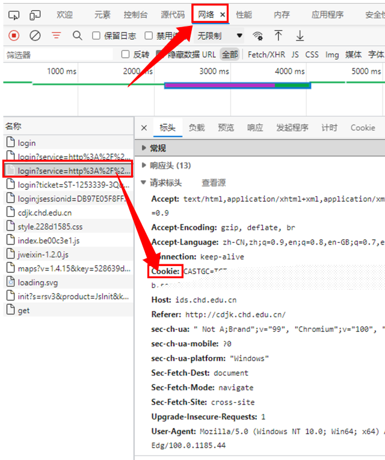

## 🔱简介

CHD sign 可以自动化打卡CHD的每日健康打卡

## 💡特性

- [x] **自动签到**  程序会在每天早上自动执行签到流程，也可以随时通过部署教程的`步骤4`手动触发，具体时间参照[此处](.github/workflows/main.yml)
- [x] **支持同步**  自动同步上游仓库，默认关闭
- [x] **支持订阅**  可选多种订阅方式，通过配置不同参数开启，每天将签到结果推送给订阅用户
- [x] **支持多账号**  不同账号的`cookie`值之间用`#`分隔，如：`cookie#cookie#cookie`

## 📐部署

1. Fork 仓库
2. 获取 cookie
3. 添加 cookie 至 Secrets
4. 启用 Actions

<details>
<summary>查看教程</summary>

### 1. Fork 仓库

- 项目地址：[github/chd_sign](https://github.com/Jade-Ray/chd_sign)
- 点击右上角`Fork`到自己的账号下
- 将仓库默认分支设置为 master 分支

### 2. 获取 cookie
浏览器打开 https://cdjk.chd.edu.cn 并登录账号

#### 2.1 方法一

- 按`F12`，打开`开发者工具`，找到`Network`并点击
- 按`F5`刷新页面，按下图复制`Cookie`



### 3. 添加 cookie 至 Secrets

- 回到项目页面，依次点击`Settings`-->`Secrets`-->`New secret`

- 建立名为`COOKIE`的 secret，值为`步骤2`中复制的`cookie`内容，最后点击`Add secret`

- secret名字必须为`COOKIE`！
- secret名字必须为`COOKIE`！
- secret名字必须为`COOKIE`！

- （可选项）建立名为`LOG`、`LAT`、`ADDR`的 secret，可以自定义定位的经纬度和详细地址，默认为学校的地址

### 4. 启用 Actions

> Actions 默认为关闭状态，Fork 之后需要手动执行一次，若成功运行其才会激活。

返回项目主页面，点击上方的`Actions`，再点击左侧的`CHD Health Sign`，再点击`Run workflow`

</details>

至此，部署完毕。

## 🔍结果

当你完成上述流程，可以在`Actions`页面点击`CHD Health Sign`-->`build`-->`Run sign`查看运行日志，注意`打卡结果`的提示。

<details>
<summary>查看结果</summary>

### 打卡成功

如果成功，会输出类似`打卡结果: 成功: 1 | 失败: 0 `的信息：

```
打卡结果: 成功: 1 | 失败: 0

	NO.1 账号:
    #########2022-04-01#########
    🔅[**学院]***
    打卡位置: 中国陕西西安
    打卡时间: 12:00:00
    打卡结果: 打卡成功
    ############################
```

### 打卡失败

如果失败，会输出类似`打卡结果: 成功: 0 | 失败: 1`的信息：

```
打卡结果: 成功: 0 | 失败: 1

	NO.1 账号:
    登录失效，请重新登录
```

同时你会收到一封来自GitHub、标题为`Run failed: CHD Health Sign - master`的邮件。

</details>

注：若开启订阅推送，无论成功与否，都会收到推送通知。

## 🔔订阅

若开启订阅推送，无论成功与否，都会收到推送通知

### Push All In One

支持Server酱推送，配置对应参数就会开启对应的推送方式，参数列表详见下文`参数`部分。

#### Server酱

以Server酱为例：

**a.获取 SCKEY**

- 使用 GitHub 登录 [sc.ftqq.com](http://sc.ftqq.com/?c=github&a=login) 创建账号
- 点击「[发送消息](http://sc.ftqq.com/?c=code)」，获取`SCKEY`
- 点击「[微信推送](http://sc.ftqq.com/?c=wechat&a=bind)」，完成微信绑定

**b.添加 SCKEY 到 Secrets**

- 建立名为`SCKEY`的 secret，并添加获取的 SCKEY 值，即可开启Server酱推送


## 🧬参数

在`Settings`-->`Secrets`里添加的参数，`Name`必须为下列的参数名称之一，`Value`则填写对应获取的值

|   参数名称         |   是否必填   |   默认值           |   说明                                                          |
|---                |---           |---                |---                                                              |
|   TONKEN          | ✅          |                    |   CHD的tonken                                                  |
|   LON             | ❌          |     108.961139     |   地理定位中的经度                                               |
|   LAT             | ❌          |      34.237077     |   地理定位的纬度                                                 |
|   ADDR            | ❌          |       长安大学      |   详细地址                                                      |
|   SCKEY           | ❌          |                    |   Server酱的SCKEY                                               |
|   CRON_SIGNIN     | ❌          | 30 9 * * *         |   DOCKER脚本的自动打卡计划任务                                   |

## ❗️协议

使用 CHD Health Sign 即表明，您知情并同意：

- 此代码通过模拟浏览器使用 cookie 登录CHD健康打卡网站，发送接收并添加定位的表单来实现健康打卡。功能通过网站抓取的 API 实现，可能存在 API 更改等风险
- 用户之 cookie 被储存于 Github 服务器，只供本项目使用。若 Github 服务器被攻破，则您的 cookie 有遭到泄露的风险。除此之外，开发者无权获取您的 cookie；即使是用户，一旦创建完成`Secrets`，也无法再次从中查看 cookie
- CHD Health Sign 不会对您的任何损失负责，包括但不限于发送异常地址、频繁打卡等行为导致的辅导员办公室一日游
